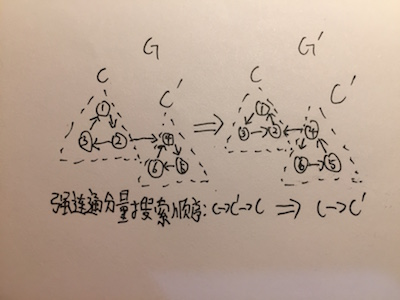
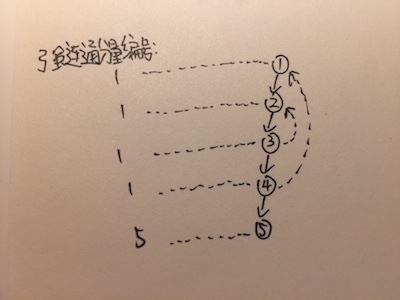
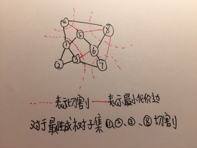
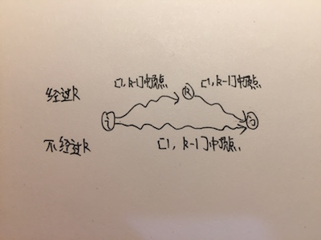

# 算法余晖

本篇主要涉及到图论的基本算法，不包含有关最大流的内容。图论的大部分算法都是由性质或推论得出来的，想朴素想出来确实不容易。

## 二分图\(Is-Bipartite\)

一个图的所有顶点可以划分成两个子集，使所有的边的入度和出度顶点分别在这两个子集中。

这个问题可以转换为上篇提到过的图的着色问题，只要看图是否能着2个颜色就行了。当然，可以回溯解决这个问题，不过对于着2个颜色可以BFS解决。

同样，一维数组colors表示节点已着的颜色。

```text
伪代码：
IS-BIPARTITE(g,colors)
  let queue be new Queue
  colors[0] = 1
  queue.push(0)
  while queue.empty() == false
    let v = queue.top()
    queue.pop()
    for i equal to every vertex in g
      if colors[i] == 0
        colors[i] = 3 - colors[v]
        queue.push(i)
      else if colors[i] == colors[v]
        return false
    end
  end
  return true
```

$$
时间复杂度:Θ(V+E)，V表示顶点的个数，E表示边的个数
$$

## DFS改良\(DFS-Improve\)

上篇文章提到过，搜索解空间是树形的，也就是在说BFS和DFS。那么在对图进行BFS和DFS有什么区别呢，这个问题要从解空间角度去理解。对图进行BFS的解空间是一颗树，可叫广度优先树。而DFS是多棵树构成的森林，可叫深度优先森林。

这里要对DFS进行小小的改良，它的性质会对解多个问题会很有帮助。原版DFS搜索的时候，会先遍历本顶点，再递归遍历临接的顶点。DFS改良希望能先递归遍历临接的顶点，再遍历本顶点，并且按遍历顺序逆序存储起来。

```text
伪代码：
DFS-IMPROVE(v,visited,stack)
  visited[v] = true
  for i equal to every vertex adjacent to v
    if visited[i] == false
      DFS-IMPROVE(i,visited,stack)
  end
  stack.push(v)
```

这个改良版DFS有个很有用的性质就是，对于两个顶点A、B，存在A到B的路径，而不存在B到A的路径，则从记录的顺序中取出的时候，一定会先取出顶点A，再取出顶点B。以下为这个性质的证明。

> 假设：有两个顶点A和B，存在路径从A到B，不存在路径从B到A。
>
> 证明：分为两种情况，情况一，先搜索到A顶点，情况二，先搜索到B顶点。对于情况一，由命题可得，A一定存储在B之后，那么取出时先取出的是顶点A。对于情况二，先搜索到B顶点，由于B顶点搜索不到A顶点，则A一定存储在B之后，那么取出时仍先取出的是顶点A，命题得证。

_**DFS改良性质：对于两个顶点A、B，存在A到B的路径，而不存在B到A的路径，则从记录的顺序中取出的时候，一定会先取出顶点A，再取出顶点B。**_

## 欧拉回路\(Eulerian-Path-And-Circuit\)

在无向图中，欧拉路径定义为，一条路径经过所有的边，每个边只经过一次。欧拉回路定义为，存在一条欧拉路径且路径的起点和终点为同一个顶点。可以看到只有连通图才能有欧拉回路和欧拉路径。

这个算法很巧。如果一条路径要经过一个顶点，本质是从一条边到达一个顶点，然后从这个顶点通过另一条边出去。欧拉回路就是要求路径要经过所有的点，起点和终点还都是同一个顶点。那么就等价于要求所有顶点连接的边是2个。实际上，路径还可以经过顶点多次，那么就等价于要求所有顶点连接的边是偶数个。欧拉路径的要求就等价于所有顶点连接的边是偶数个，除了起点和终点两个顶点可以是奇数个。

先判断图是否是连通图。返回0代表没有欧拉回路或者欧拉路径，返回1代表有欧拉路径，返回2代表有欧拉回路。

```text
伪代码：
EULERIAN-PATH-AND-CIRCUIT(g)
  if isConnected(g) == false
    return 0
  let odd = 0
  for v equal to every vertex in g
    if v has not even edge 
      odd = odd + 1
  end
  if odd > 2
    returon 0
  if odd == 1
    return 1
  if odd == 0
    return 2
```

$$
时间复杂度:Θ(V+E)，V表示顶点的个数，E表示边的个数
$$

## 拓扑排序\(Topological-Sorting\)

将一张有向无环图的顶点排序，排序规则是所有边的入度顶点要在出度顶点之前。可以看到，无向和有环图都不存在拓扑排序，并且拓扑排序可能存在多种解。

拓扑排序有两种解法，一种是从搜索角度。

如果我能保障先递归遍历临接的顶点，再遍历本顶点的话，那么遍历的顺序的逆序就是一个拓扑排序。那么就可以直接用DFS改良求解出拓扑排序。

```text
伪代码：
TOPOLOGICAL-SORTING-DFS(g)
  let visited be new Array
  let result be new Array
  let stack be new Stack
  for v equal to every vertex in g
    if visited[v] == false
      DFS-IMPROVE(v,visited,stack)
  end
  while stack.empty() == false
      result.append(stack.top())
      stack.pop()
  end
  return result      
```

$$
时间复杂度:Θ(V+E)，V表示顶点的个数，E表示边的个数
$$

另一种是贪心选择。

直觉上，既然要所有边的出度顶点在入度顶点之前，可以从入度和出度角度来解决问题。可以让入度最小的排序在前，也可以让出度最大的排序在后，排序后，这个顶点的边都不会再影响问题了，可以去掉。去掉后再重新加入新的顶点，直到加入所有顶点。

这个问题还有个隐含条件，挑选出、入度最小的顶点就等价于挑选出、入度为0的顶点。这是因为图必须是无环图，所以肯定存在出、入度为0的顶点，那么出、入度最小的顶点就是出、入度为0的顶点。

直觉上这是一个可行的策略，细想一下，按出度最大排序和按入度为零排序是否等价。实际上是不等价的，按入度为零排序，如果出现了多个入度为零的顶点，这多个顶点排序的顺序是无关的，可以任意排序。而按出度最大排序，出现了多个入度最大的顶点，这多个顶点排序是有关的，不能任意排序。所以，只能按入度为零排序。实际上，这个想法就是贪心选择。下面以挑选入度为零的边作为贪心选择解决问题，同样地，还是先证明这个贪心选择的正确性。

> 命题：入度为零的顶点v排序在前。
>
> 假设：S为图的一个拓扑排序，l为此排序的首个顶点。
>
> 证明：如果l=v，则命题得证。如果l不等于v，将l顶点从S中去除，然后加入顶点v得到新的排序S‘。因为S去除l以后l以后的排序没有变，仍为拓扑排序，v入度为零，v前面可以没有顶点，所以S'也为图的一个拓扑排序，命题得证。

```text
伪代码：
TOPOLOGICAL-SORTING-GREEDY(g)
  let inDegree be every verties inDegree Array
  let stack be new Stack
  let result be new Array
  for v equal to every vertex in g
    if inDegree[v] == 0
      stack.push(v)
  end
  while stack.empty() == false
    vertex v = stack.top()
    stack.pop()
    result.append(v)
    for i equal to every vertex adjacent to v 
      inDegree[i] = inDegree[i] - 1
      if inDegree[i] == 0
        stack.push(i)
    end
  end
  return result.reverse()
```

$$
时间复杂度:Θ(V+E)，V表示顶点的个数，E表示边的个数
$$

## 强连通分量\(Strongly-Connected-Components\)

图中的一个顶点与另一个顶点互相都有路径可以抵达，就说这两个顶点强连通。图中有多个顶点两两之间都强连通，则这多个顶点构成图的强连通分量。

朴素的想法是，假如从一个顶点A可以搜索到另一个顶点B，如果从B顶点再能搜索回A顶点的话，A、B就在一个强连通分量中。不过，这样每两个顶点要进行两次DFS，复杂度肯定会很高。这里可以引入转置图\(将有向边的方向翻转\)的性质。这样问题就转换成了，从A顶点搜索到B顶点，将图转置后，如果再A顶点还能搜索到B顶点，A、B顶点就在一个强连通分量中。用算法表述出来就是先从A顶点DFS，然后将图转置，再从A顶点DFS，两次DFS都能搜索到B顶点的话，B顶点就与A顶点在同一个强连通分量中。然而朴素想法只能想到这里了。

有多个算法被研究出来解决这个问题，下面先介绍Kosaraju算法。

* Kosaraju

Kosaraju算法使用了DFS改良的性质去解决问题，想法很有趣。Kosaraju算法现将图进行DFS改良，然后将图转置，再进行DFS。第二次DFS每个顶点能够搜索到的点就是一个强连通分量，下面是这个算法的正确性证明。

通过_**DFS改良性质**_可以得出定理，一个强连通分量C如果有到达另一个强连通分量C'的路径，则C'比C先被搜索完，这个定理很明显，如果C中有路径到C'，那么根据_**DFS改良性质**_一定会先搜索到C，再搜索完C'，再搜索完C。将这个定理做_**定理1**_。

_**定理1：一个强连通分量C如果有到达另一个强连通分量C'的路径，则C'比C先被搜索完。**_

_**定理1**_还可以再进行推论，如果一个强连通分量C有到达另一个强连通分量C'的路径，则将图转置后，C比C'先被搜索完，这个推论也很明显，将图转置后，不存在C到C'的路径，存在C'到C的路径，而仍是先搜索C再搜索C‘，所以C比C‘先被搜索完，这个推论作为_**推论1**_。

_**推论1：如果一个强连通分量C有到达另一个强连通分量C'的路径，则将图转置后，C比C'先被搜索完。**_ 



以下为用结构归纳法对算法正确性进行证明。

> 命题：第二次DFS每个顶点能够搜索到的点就是一个强连通分量。
>
> 假设：n代表图中有多少个强连通分量。
>
> 证明：如果n=1，则第二次DFS就是搜索一遍所有顶点，命题得证。现在假设n=k时，命题成立。现证明n=k+1时，是否成立。假设搜索到第k+1个强连通分量的第一个顶点为u，u肯定能搜索到所有k+1个强连通分量的顶点。并且根据_**推论1**_，此时被转置后的图，所有从第k+1个强连通分量能到达的其他强连通分量都已经被搜索过了。所以u只能搜索到所有第k+1个强连通分量的顶点，即第二次DFS每个顶点只能够搜索到包含此顶点的强连通分量中的顶点，命题得证。

```text
伪代码：
KOSARAJU-STRONGLY-CONNECTED-COMPONENTS(g)
  let visited be new Array
  let stack be new Stack
  for v equal to every vertex in g
    if visited[v] == false
      DFS-IMPROVE(v,visited,stack)
  end
  let gt = transpose of g
  for v equal to every vertex in g
    visited[v] = false
  end
  while stack.empty() == false
    vertex v = stack.top()
    stack.pop()
    if visited[v] == false
      DFS(v,visited)
      print '\n Found a Strongly Connected Components \n'
  end
 
DFS(v,visited)
  visited[v] = true
  print v
  for i equal to every vertex adjacent to v
    if visited[i] == false
      DFS(i,visited,stack)
  end
```

$$
时间复杂度:Θ(V+E)，V表示顶点的个数，E表示边的个数
$$

Kosaraju算法需要进行两次DFS，那么可不可以只进行一次DFS，边遍历边找强连通分量？Tarjan就是这样的算法。

* Tarjan

同样，还是要基于DFS搜索性质来思考问题。DFS创建出的深度优先搜索树会先被访问根节点再被访问子孙节点。什么时候会出现强连通分量？只有子孙节点有连通祖先节点的边的时候。如果从某个节点，其子孙节点都只有指向自己子孙节点的边的时候，这是明显没有构成强连通分量的。那么，出现了子孙节点指向其祖先节点的时候，从被指向的祖先节点一直搜索到指向的子孙节点所经过所有顶点就构成了一个强连通分量。如果出现了多个子孙节点都指向了祖先节点怎么办？最早被指向、访问的祖先节点到最晚指向、访问的子孙节点构成了“最大“的强连通分量，这才是想要找的强连通分量。如果遇到了一个指向祖先节点的子孙节点，就算构成一个强连通分量，会导致找到多个互相嵌套的强连通分量。那么，要记录访问顺序就要为每个节点设置一个被访问顺序的编号，让属于同一个强连通分量的顶点编号一致。上面讨论的是构成了一个强连通分量怎么处理，如果没有多个节点构成的强连通分量怎么处理？在搜索节点之前，为这个节点默认设置上被访问的顺序编号，这样如果没有搜索到多个节点构成的强连通分量，每个节点就是自己的强连通分量。



算法表述为，从某个节点开始搜索，默认设置自己为一个强连通分量。只要节点有子孙节点，就要等待子孙节点都搜索完，再更新自己强连通分量信息。只要节点有指向祖先节点，也要更新自己的强连通分量。判断子孙节点构成的强连通分量”大“还是自己构成的强连通分量”大“，自己属于最”大“的强连通分量。也就是说，算法找出了所有顶点的所属的最“大”强连通分量。

数组disc表示顶点被访问顺序的编号，数组low表示顶点所在的强连通分量编号。最后当顶点在disc和low中编号一致时，代表顶点是所在强连通分量中第一个被搜索到的顶点。此时，输出所在的强连通分量所包括的顶点。

```text
伪代码：
TARJAN-STRONGLY-CONNECTED-COMPONENTS(g)
  let disc be new Array
  let low be new Array
  let stack be new Stack
  let isInStack be new Array
  for i from 1 to the number of vertex in g
    disc [i] = -1
    low [i] = -1
  end
  for u from 1 to the number of vertex in g 
    if disc[i] != -1
      TARJAN-STRONGLY-CONNECTED-COMPONENTS-UTIL(u,disc,low,stack,isInStack)
  end
  
TARJAN-STRONGLY-CONNECTED-COMPONENTS-UTIL(u,disc,low,stack,isInStack)
  let time be static
  time = time + 1
  disc[u] = low[u] = time
  stack.push(u)
  isInStack[u] = true
  for v equal to every vertex adjacent to u
    if disc[v] == -1
      TARJAN-STRONGLY-CONNECTED-COMPONENTS-UTIL(v,disc,low,stack,isInStack)
      low[u] = min(low[u],low[v])
    else if isInStack[v] == true
      low[u] = min(low[u],disc[v])
  end
  let w = 0
    if low[u] == disc[u]
      while stack.top() != u
        w = stack.top()
        isInStack[w] = false
        stack.pop()
        print w
      end
      w = stack.top()
      isInStack[w] = false
      stack.pop()
      print w
      print '\n Found a Strongly Connected Components \n'
```

$$
时间复杂度:Θ(V+E)，V表示顶点的个数，E表示边的个数
$$

## 图的割点\(Articulation Points\)、桥\(Bridge\)、双连通分量\(Biconnected Components\)

* 图的割点\(Articulation-Points\)

图的割点也叫图的关节点，定义为无向图中分割两个连通分量的点，或者说去掉这个点，图中的连通分量数增加了。可以看到如果求出了连通分量，那么不同连通分量中间的顶点就是割点。什么时候某个顶点不是这样的割点？如果这个顶点的子孙顶点有连接这个顶点祖先顶点的边，那么去掉这个顶点，这个顶点的子孙顶点和祖先顶点仍然连通。那么，寻找割点的过程就等价于寻找子孙顶点没有连接祖先顶点的顶点。这个问题的求解过程类似于Tarjan强连通分量的求解过程。

不过，这个问题有个例外就是根顶点，对一般顶点的处理方式处理根顶点行得通吗？根顶点肯定没有子孙顶点指向祖先顶点，但是根顶点可以是割点。所以，根顶点需要特殊处理。根顶点什么时候是割点？当根顶点有多颗子树，且之间无法互相到达的时候。那么，存不存在根顶点有多颗子树，且之间可以互相到达？不存在，如果互相之间可以到达，那在根顶点搜索第一颗子树的时候，就会搜索到可到达的子树，就不会存在多颗子树了。所以，根顶点有多颗子树，那么这多颗子树之间一定无法互相到达。根顶点有多颗子树，且之间无法互相到达的时候就等价于根顶点有多颗子树。所以，只要根顶点有多颗子树，那么根顶点就是割点。

同样地，数组disc表示顶点被访问顺序的编号，数组low表示顶点所在的强连通分量编号。数组parent找出根顶点。

```text
伪代码：
ARTICULATION-POINTS(g)
  let disc be new Array
  let low be new Array
  let result be new Array
  let parent be new Array
  let visited be new Array
  for i from 1 to the number of vertex in g
    result [i] = false
    visited [i] = false
    parent [i] = -1
  end
  for u from 1 to the number of vertex in g 
    if visited[i] == false
      ARTICULATION-POINTS-UTIL(u,disc,low,result,parent,visited)
  end
  for i from 1 to the number if vertex in g
    if result[i] == true
      print '\n Found a Articulation Points i \n'
  end
  
ARTICULATION-POINTS-UTIL(u,disc,low,result,parent,visited)
  let time be static
  time = time + 1
  let children = 0
  disc[u] = low[u] = time
  visited[u] = true
  for v equal to every vertex adjacent to u
    if visited[v] == false
      children = children + 1
      parent[v] = u
      ARTICULATION-POINTS-UTIL(u,disc,low,result,parent,visited)
      low[u] = min(low[u],low[v])
      if parnet[u] == -1 and children > 1
        result[u] = true
      if parent[u] != -1 and low[v] >= disc[u]
        result[u] = true
    else if v != parent[u]
      low[u] = min(low[u],disc[v])
  end
```

$$
时间复杂度:Θ(V+E)，V表示顶点的个数，E表示边的个数
$$

* 桥\(Bridge\)

桥定义为一条边，且去掉这个边，图中的连通分量数增加了。类似于寻找割点，寻找桥就是寻找这样一条，一端的顶点的子孙顶点没有连接这个顶点和其祖先顶点的边。求解过程和求割点基本一致。

```text
伪代码：
BRIDGE(g)
  let disc be new Array
  let low be new Array
  let parent be new Array
  let visited be new Array
  for i from 1 to the number of vertex in g
    visited [i] = false
    parent [i] = -1
  end
  for u from 1 to the number of vertex in g 
    if visited[i] == false
      BRIDGE-UTIL(u,disc,low,parent,visited)
  end
  
BRIDGE-UTIL(u,disc,low,parent,visited)
  let time be static
  time = time + 1
  disc[u] = low[u] = time
  for v equal to every vertex adjacent to u
    if visited[v] == false
      parent[v] = u
      BRIDGE-UTIL(u,disc,low,parent,visited)
      low[u] = min(low[u],low[v])
      if low[v] > disc[u]
        print '\n Found a Bridge u->v \n'
    else if v != parent[u]
      low[u] = min(low[u],disc[v])
  end
```

$$
时间复杂度:Θ(V+E)，V表示顶点的个数，E表示边的个数
$$

* 双连通分量\(Biconnected-Components\)

双连通图定义为没有割点的图。双连通图的极大子图就为双连通分量。双连通分量就是在割点分割成多个连通分量处，共享割点。也就是说双连通分量是去掉割点后构成的连通分量，加上割点和到达割点的边。可以看出，双连通分量可分为不含有割点、一个割点、两个割点三种情况。对于不含有割点，说明图为双连通图。对于含有一个割点，可能为初始搜索的顶点到第一个割点之间的边构成的双连通分量，可能为遇到一个割点后到不再遇到割点之间的边构成双连通分量。对于含有两个割点，两个割点之间的边构成了一个双连通分量。

求解此问题，只要在求割点的算法上做更改就可以了。按照求割点的算法求解割点，找到一个割点，输出找到的边，然后删除找到的边的记录，再去搜索下一个割点。每搜索完图某个顶点的可达顶点，输出找到的边。这样就涵盖了所有的情况。

```text
伪代码：
BICONNECTED-COMPONENTS(g)
  let disc be new Array
  let low be new Array
  let stack be new Stack
  let parent be new Array
  for i from 1 to the number of vertex in g
    disc [i] = -1
    low [i] = -1
    parent [i] = -1
  end
  for u from 1 to the number of vertex in g 
    if disc[i] == -1
      BICONNECTED-COMPONENTS-UTIL(u,disc,low,stack,parent)
    let flag = flase
    while stack.empty() == false
      flag = true
      print stack.top().src -> stack.top().des
      stack.pop()
    end
    if flag == true
      print '\n Found a Bioconnected-Components \n'
  end
  
BICONNECTED-COMPONENTS-UTIL(u,disc,low,stack,parent)
  let time be static
  time = time + 1
  let children = 0
  disc[u] = low[u] = time
  for v equal to every vertex adjacent to u
    if disc[v] == -1
      children = children + 1
      parent[v] = u
      stack.push(u->v)
      BICONNECTED-COMPONENTS-UTIL(u,disc,low,stack,parent)
      low[u] = min(low[u],low[v])
      if (parnet[u] == -1 and children > 1) or (parent[u] != -1 and low[v] >= disc[u])
        while stack.top().src != u or stack.top().des != v
          print stack.top().src -> stack.top().des
          stack.pop()
        end
        print stack.top().src -> stack.top().des
        stack.pop()
        print '\n Found a Bioconnected-Components \n'
    else if v != parent[u] and disc[v] < low[u]
      low[u] = min(low[u],disc[v])
      stack.push(u->v)
  end
```

$$
时间复杂度:Θ(V+E)，V表示顶点的个数，E表示边的个数
$$

## 最小生成树\(Minimum-Spanning-Tree\)

生成树是指，在一个连通、无向、有权的图中，所有顶点构成的一颗树。图中可以有多颗生成树，而生成树的代价就是树中所有边的权重的和。最小生成树就是生成树中代价最小的。

朴素的想法就是从图中选择最小权重的边，直到生成一颗树。看通用的算法之前，同样要讨论一下最小生成树的性质。

对于一个连通、无向、有权图中，一定有最小生成树。如果图不包含最小生成树的任意一条边，那么图就是不连通的了，这与已知连通图不符，所以图必包含最小生成树。

假设，A为某个最小生成树的子集\(任意一个顶点都是最小生成树的子集\)。

那么，为A一直添加对的边，A最后就会成为一颗最小生成树。那么最小生成树问题就转换成为了，一直找到对的边，直到成为一颗最小生成树。这个对的边可以叫做安全边。

安全边如何寻找显然就成了解决这个问题的关键点。

再假设，图中所有顶点为V，将所有顶点切割成两个部分S和V减去S。所有连接这两个部分的边，很形象的叫做横跨切割，这些边横跨了两个部分，成为这两个部分的桥梁。这里还有个问题，如何切割？使A不包含横跨切割。这样的切割有多种切法，切割后，横跨切割的最小代价边就为A的安全边。将这个作为_**定理1**_。 



_**定理1：存在这样一个将所有顶点分成两个部分的切割，且使某个最小生成树子集A不包含横跨切割。则横跨此切割的最小代价边，就是A的安全边。**_

以下为此定理的证明，这个定理的基础实际上是连通性。

> 命题：横跨切割的最小代价边为A的安全边。
>
> 假设：横跨切割后的最小代价边为x，有最小生成树T包含A，但是不包含x。
>
> 证明：既然T不包含x，那么T必须包含另一条连接x两端顶点的路径，这条路径上又必须有条边横跨切割。假设这条边为y。T将y减去后，x两端的顶点就无法互相到达。这时如果再加上x，那么x两端的顶点又可以互相到达，并且构造了另一颗生成树T'。可以看到，x的代价小于或等于y的代价，那么T‘的代价也小于或等于T的代价，那么T’也就是一颗最小生成树。那么x既不在A中，x又在一颗包含A的最小生成树中。命题得证。

可以看到这个证明过程使用的就是经常拿来证明贪心选择的技巧，也就是说最小生成树问题符合贪心算法的特征，也就解释了为什么下面将要提到的两个算法都是贪心算法。

_**定理1**_还可以进行推论，既然切割有多种方法，那可不可以对A和其余的顶点进行切割，设B为包括A和所有顶点构成的一个森林，C是其中的一个连通分量，那么C连接其他的连通分量的最小代价边是A的安全边。这个推论很好证明，因为A是B中的一个或者多个连通分量，如果按照C去切割图分成C和B减去C，不可能切割A，即A中必定不包含横跨切割。那么，横跨这个切割的最小代价边就是安全边，即C连接其他连通分量的最小代价边，推论成立。将这个推论作为_**推论1**_。

_**推论1:某个最小生成树子集A和其他顶点构成的森林中，任意一个连通分量连接其他连通分量的最小代价边都为A的安全边。**_

如果从所有不在A中的边选择最小代价的边，这个边一定连接着某个连通分量，这个推论也就将选安全边的范围拓展到任意一条不在A中的边。这个推论正好可以证明朴素想法的正确性。

接下来看一下最小生成树的三个通用的算法Kruskal、Prime、Boruvka。

* Kruskal

朴素想法和Kruskal已经很接近了。Kruskal算法做的就是一直选择代价最小的边，不过，如果选择这个边后，无生成最小生成树，而生成图了怎么办？Kruskal比朴素想法巧的地方就是不选择会成环的边。

Kruskal常用的检查是否成环的数据结构是UnionFind\(并查集\)，UnionFind有个操作，一个是Find检查元素所在集合的编号，Union将两个元素合并成一个集合。

```text
KRUSKAL(g)
  let edges be all the edges of g
  sort(edges)
  let uf be new UnionFind
  let e = 0
  let i = 0
  let result be new Array
  while e < edges.length()
    let edge = edges[i]
    i = i + 1
    if uf.find(edge.src) != uf.find(edge.des)
      result.append(edge)
      e = e + 1
      uf.union(edge.src,edge.des)
  end
  return result
```

$$
时间复杂度:O(E\log_{2}{E}+E\log_{2}{V})，即排序E个边加上E次UnionFind操作，V表示顶点的个数，E表示边的个数
$$

* Prim

有了推论1，Prim算法的正确性理解起来就很简单了，一直只对最小生成树子集进行切割，然后选择出最小生成树子集与其他连通分量的最小代价边就OK了。Prim算法就是一直选择最小生成树子集与其他顶点连接的最小代价边。

Prim算法维持这样一个最小堆，存储最小生成树子集以外的顶点，与最小生成树子集临接的顶点的权重是其临接边的值，其余的最小堆中的顶点权重都是无穷。Prim算法初始将起始顶点在最小堆中的权重置为0，其余的顶点置为无穷。然后从最小堆中一直取权重最小的顶点，即选择最小代价边加入最小生成树，如果取出的顶点的临接顶点不在最小生成树中，且这个临接顶点在最小堆中的权重比边大，则更新临接顶点在最小堆的权重，直到从最小堆中取出所有的顶点，就得到了一颗最小生成树。

```text
伪代码：
PRIM(g,s)
  let heap be new MinHeap
  let result be new Array
  for i from 1 to the number of vertex in g
    let vertex be new Vertex(i)
    vertex.weight = INT_MAX
    heap.insert(vertex)
  end
  heap.decrease(s,0)
  while heap.empty() == false
    vertex v = heap.top()
    for u equal to every vertex adjacent to v
      if heap.isNotInHeap(u) and v->u < heap.getWeightOfNode(u)
        result[u] = v
        heap.decrease(u,v->u)
    end  
  end
  return result
```

$$
时间复杂度:O(E\log_{2}{V}+V\log_{2}{V})，即对V个顶点和E条边进行decrease操作，V表示顶点的个数，E表示边的个数
$$

* Boruvka

Kruskal是根据所有边中最小代价边的一端的连通分量分割，Prim根据最小生成子树的子集分割，Boruvka根据所有的连通分量分割，实际上都是基于_**推论1**_。Boruvka算法将所有连通分量与其他连通分量的最小代价边选择出来，然后将这些边中未加入最小生成树子集的加进去，一直到生成最小生成树。

Boruvka算法同样使用了UnionFind去记录连通分量，用cheapest数组记录连通分量与其他连通分量连接的最小代价边的编号。

```text
伪代码：
Boruvka(g)
  let uf be new UnionFind
  let cheapest be new Array
  let edges be all the edge of g
  let numTree = the number of vertex in g
  let result be new Array
  for i from 1 to number of vertex in g
    cheapest[i] = -1
  end
  while numTree > 0
    for i from 1 to the number of edge in g
      let set1 = uf.find(edges[i].src)
      let set2 = uf.find(edges[i].des)
      if set1 == set2
        continue
      if cheapest[se1] == -1 or edges[cheapest[set1]].weight > edges[i].weight
        cheapest[set1] = i
      if cheapest[set2] == -1 or edges[cheapest[set2]].weight > edges[i].weight
        cheapest[set2] = i
    end
    for i from 1 to the number of vertex in g
      if cheapest[i] != -1
        let set1 = uf.find(edges[cheapest[i]].src)
        let set2 = uf.find(edges[cheapest[i]].des)
        if set1 == set2
          continue
        result[edges[cheapest[i]].src] = edges[cheapest[i]].des 
        uf.union(set1,set2)
        numTree = numTree - 1
    end
  end
  return result
```

$$
时间复杂度:O(E\log_{2}{V})，V表示顶点的个数，E表示边的个数
$$

## 单源最短路径\(Single-Source-Shortest-Paths\)

给出一张连通、有向图，找出一个顶点s到其他所有顶点的最短路径。可以看到，如果图中存在负环，不存在最短路径。因为存在负环就可以无限循环负环得到更短的路径。

看通用的算法之前，同样要讨论一下问题的性质。

假设，存在一条顶点s到顶点v的最短路径，i、j为路径上的两个顶点。那么在这条s到v最短路径上，i到j的路径是否是i到j的最短路径？是的，如果存在i到j的更短路径，就等价于存在一条s到v的更短路径，这与假设不符。也就是说，如果存在一条从s到v的最短路径，这条路径上任意两个顶点的路径都是这两个顶点的最短路径。那么，这个问题就具有动态规划的状态转移特征。

解决此问题的朴素想法就是求出所有顶点s到顶点v的路径，然后取最小值。那么要是实现这个步骤，就要为v点存储一个估计值d，并设起始为无穷，如果有到达v的路径小于这个估计值，更新这个估计值，并且记录v的现阶段最小路径。这步操作叫做松弛操作\(relax\)。假设u为小于估计值路径上的上个顶点。

```text
RELAX(u,v,result)
  if v.d > u.d + u->v
    v.d = u.d + u->v
    result[v] = u
```


那么，算法要做的就是一直松弛到达v顶点的路径，从无穷直到最小路径。可以看到，所有的求最短路径的算法都要基于这个操作去求解，不同的算法只能就是执行这个操作顺序不同或者次数不同。那么松弛操作会不会出问题，会不会松弛操作做过头了，将v的估计值松弛的比最短路径还小？不会，在算法运行期间，对于所有顶点，一直对顶点进行松弛操作，顶点的预估值不会低于最短路径。以下用结构归纳证明法证明。

> 假设：u代表任意一个连接v的顶点，s-&gt;v代表s到v的边，s~&gt;v代表s到v的最短路径。
>
> 命题：对到达v的所有路径松弛操作有v.d &gt;= s~&gt;v
>
> 证明： 对于v=s的情况，v.d=0 s~v即s~s也为0，命题得证 假设对于顶点u，u.d &gt;= s~&gt;u成立。 有s~&gt;v &lt;= s~&gt;u + u-&gt;v，因为s~&gt;v是一条最短路径，对于任意一条经过u到达v的路径，必小于最短路径。 s~&gt;v &lt;= u.d + u-&gt;v 因为经过松弛操作v.d = u.d + u-&gt;v，所以v.d &gt;= s~&gt;v，命题得证。

松弛操作只能同时对一条边起作用。所以，最短路径长为n的路径，只能从最短路径长为n-1的路径，转移过来。这里就得到了这个问题最重要的性质，单源最短路径问题是个最短路径每次递增一的动态规划问题。

_**单源最短路径性质：此问题是个最短路径每次长度递增一的动态规划问题。**_

在介绍通用算法之前，先介绍一种专对于有向无环图很巧的算法。

* 有向无环图单源最短路径\(DAG-Shortest-Paths\)

对于有向无环图，可以先对图进行拓扑排序，然后按拓扑排序的顺序对每个顶点作为出度的边进行松弛操作，就得到了问题的一个解。以下证明算法的正确性。

> 假设v为对图拓扑排序后的某个顶点。当对v作为出度的边进行松弛操作前，所有能到达v的路径都已经做过了松弛操作，此时已经找到了到达v的最短路径。那么，当对所有顶点作为出度的边进行松弛操作后，所有顶点的最短路径就已经被找到。算法的正确性得到证明。

```text
伪代码：
DAG-SHORTEST-PATHS(g)
  let sorted = TOPOLOGICAL-SORTING-GREEDY(g)
  let result be new Array
  for u equal to every vertex in sorted
    for v equal to every vertex adjacent to u 
      if v.d > u.d + u->v
        RELAX(u,v,result)
    end
  end
  return result
```

$$
时间复杂度:O(E+V)，V表示顶点的个数，E表示边的个数
$$

接下来介绍两种通用的算法Bellman-Ford和Dijkstra。Bellman-Ford和Dijkstra有什么联系呢？Bellman-Ford可以解决有负权重图的单源最短路径问题，并且可以侦测出图中是否存在负环。Dijkstra只能解决没有负权重边的图的单源最短路径问题。Bellman-Ford是进行必须的最少次数的松弛操作。而Dijkstra发现，只要没有负权重边，还能进行更少的松弛操作解决问题。

* Bellman-Ford

Bellman-Ford是最通用的解决单源最短路径算法，初始将所有顶点估计值设为无穷，将源点设为零。然后，对所有边进行松弛操作，这个步骤作为内部循环。再将这个步骤做图的顶点个数减一次。

Bellman-Ford的正确性不难证明，可以看到随着Bellman-Ford算法内部的循环，Bellman-Ford找到的最短路径的长度也在增加。首先证明内部循环在循环到第n次时，找到了所有最短路径长为n的路径。我们用结构归纳证明法。在以下证明中，可以看出Bellman-Ford虽然不是经典的动态规划算法，但是其原理是基于这个问题的动态规划性质的。

> 证明：
>
> 对于n=0时，最短路径为0，命题得证。
>
> 假设所有最短路径为n-1的路径已经被找到。因为根据单源最短路径的动态规划性质，最短路径长为n的路径，可以从最短路径长为n-1的路径，转移过来的。因为Bellman-Ford算法会对所有的边进行松弛操作。所以，所有长为n的最短路径会从相应的长为n-1的最短路径找到。命题得证。
>
> 只要最短路径上不存在负环，那么所有最短路径就必小于V-1。所以，Bellman-Ford内部循环执行V-1次，能找到最长的最短路径，也就是能找到所有的最短路径。Bellman-Ford正确性证毕。

Bellman-Ford实现也很简单，这里添加一个flag位，提前省去不必要的循环。

```text
伪代码：
BELLMAN-FORD(g,s)
  let edges be all the edge of g
  let result be new Array
  for i from 1 to the number of vertex of g
    result[i] = INT_MAX
  end
  result[s] = 0
  for i from 1 to the number of vertex of g minus 1
    let flag = false
    for j from 1 to the numnber of edge of g
      let edge = edges[j]
      if result[edge.src] != INT_MAX and edge.src > edge.des + edge.weight
        RELAX(u,v,result)
        flag = true
    end
    if flag == false
      break
  end
  return result
```

$$
时间复杂度:O(V \cdot E)，V表示顶点的个数，E表示边的个数
$$

为什么Bellman-Ford算法可以侦测出有负环？算法完成后再对图的所有边进行一次松弛操作，如果最短路径求得的值改变了，就是出现了负环。这个证明看一下松弛操作的定义就行了。根据松弛操作的性质，顶点的估计在等于最短路径后不会再改变了，如果改变了就是出现了负环，从而没有得到最短路径。

* Dijkstra

Dijkstra是个贪心算法，朴素的想一下，用贪心算法怎么解决问题。既然没有负权边，选出当前阶段最短的路径，这个路径就应该是到达这个路径终点的最短路径。

Dijkstra就是这样一个贪心算法，初始将所有顶点估计值设为无穷，将源点设为零。维护一个集合S代表已经找到的最短路径顶点，然后从集合S外所有顶点，选择有最小的估计值的顶点加入到集合中，然后再对这个顶点在S中的临接顶点做松弛操作，一直到所有顶点都在集合S中。

Dijkstra的贪心选择使用简单的反证法就可以证出。

> 假设，现阶段要选从s到某个顶点u的路径作为最短路径加入到集合S中，并且这个选择是错误的。有另一条最短路径从s到达u，那么这条路径和原选择的路径肯定不一致，经过不同的顶点，假设这条最短路径上到达u的前一个顶点为k，既然这是一条从s到达u的最短路径，那么从s到k肯定比从s到v小，那么算法会先选择从s到k，然后选择最短路径，不会选择假设的路径，这与假设矛盾，假设不成立，贪心选择正确性得证。

以下是算法导论上的证明，尝试从实际发生了什么去证明正确性，我认为有点clumsy\(笨重\)，核心的想法其实和上面简单的反证法一致。

> 命题：选择有最小估计值的顶点加入集合S，那么这个估计值必定是这个顶点的最小路径。
>
> 同样使用反证法来证，并且关注已经选择了最小预估值的顶点但还没加入顶点S时的情形。
>
> 假如选择了顶点u，这时，将从s到u作为最小条路径加入到S中，分为两种情况。情况一，选择的从s到u的路径就是最短路径，那么命题已经得证。情况二，选择的从s到u的路径不是最短路径，存在u.d&gt;s~&gt;u。这种情况下，可以找到一个顶点x，使得x在集合S中，并在对x进行松弛操作后，找到另一个顶点y，使得y不在集合中且y的估计值就等于s到y的最短路径即s~&gt;y。x可以与s重合，y可以与u重合。
>
> 那么有y.d = s~&gt;y 因为从s到y是从s到u的子路径，有s~&gt;u &gt;= s~&gt;y 得出s~&gt;u &gt;= y.d 因为选择了顶点u，有u.d &lt;= y.d 得出s~&gt;u &gt;= u.d 这与假设矛盾，所以假设不成立，命题得证。

实现和时间复杂度与Prim算法类似，集合S用最小堆实现。

```text
伪代码：
DIJKSTRA(g,s)
  let heap be new MinHeap
  let result be new Array
  for i from 1 to the number of vertex in g
    let vertex be new Vertex(i)
    vertex.d = INT_MAX
    heap.insert(vertex)
  end
  heap.decrease(s,0)
  while heap.empty() == false
    vertex u = heap.top()
    for v equal to every vertex adjacent to u
      if heap.isNotInHeap(v) and u.d v.d > u.d + u->v
        RELAX(u,v,result)
        heap.decrease(v,v.d)
    end  
  end
  return result
```

$$
时间复杂度:O(E\log_{2}{V}+V\log_{2}{V})，即对V个顶点和W条边进行decrease操作，V表示顶点的个数，E表示边的个数
$$

可以看到，如果运气好，Bellman-Ford不需要V次循环就可以找到所有最短路径，但是运气不好，Bellman-Ford要经过最少V次循环，这就是上文说到的，Bellman-Ford是进行必须的最少次数的松弛操作。而如果不存在负权重边，Dijkstra可以进行更少次的松弛操作，至多对每个顶点连接的边进行一次松弛操作就可以了，Bellman-Ford与Dijkstra的联系实际上就是动态规划与贪心算法的联系。Bellman-Ford和Dijkstra算法本质都是_**单源最短路径性质**_。

## 全对最短路径\(All-Pair-Shortest-Paths\)

全对最短路径就是将图中任意两点之间的最短路径求出来，输出一个矩阵，每个元素代表横坐标作为标号的顶点到纵坐标作为标号的顶点的最短路径。当然，可以对所有顶点运行一次Bellman-Ford算法得出结果，不过这样的复杂度就太高了。尝试去找到更好的算法解决这个问题。

既然单源最短路径是个最短路径递增一的动态规划问题，尝试对全对最短路径使用这种性质，然后看看能不能降低复杂度。

假设有n个顶点，dp\_ij代表从顶点i到顶点j的最短路径，假设最短路径长为m，k为任意顶点。那么，根据这个问题的动态规划状态转移特征，dp\_ij是由长度为m-1的dp\_ik加上k-&gt;j转移过来的。

$$
则状态转移公式为：dp^m_{i,j}=\begin{equation}  
\left\{  
             \begin{array}{lr}  
             0 & i=j \\  
              \min\limits_{1\leq k\leq n}(dp^{m-1}_{i,k}+k->j) & i\not= j\\  
             \end{array}  
\right.  
\end{equation} \\ i、j、k、m取值范围都为[1,n]，则时间复杂度为Θ(n^4)
$$

看来即使在单源最短路径动态规划的性质上进行求解，复杂度仍然很高。

尝试不从最短路径长度角度考虑动态规划，从顶点角度去考虑动态规划，引出一个通用的算法Floyd-Warshall。

* Floyd-Warshall

好，从顶点的角度去思考动态规划。从顶点i到顶点j要经过其他顶点，假设经过的顶点为k。然后根据解动态规划的经验，猜想dp\_ij与dp\_ik和dp\_kj怎么能沾到边？假设从i到j只需要经过\[1,k\]集合中的顶点。如果从i到j经过k，那么dp\_ik就代表从i到k的最短路径，dp\_kj就代表从k到j的最短路径，dp\_ij就等于从dp\_ik和dp\_kj转移过去，而dp\_ik和dp\_kj都不经过k，都只需经过\[1,k-1\]集合中的顶点。如果从i到j不经过k，dp\_ij就等于从i到j只需要经过\[i,k-1\]集合中的顶点时的dp\_ij。



$$
则状态转移公式为：dp^k_{i,j}=\begin{equation}  
\left\{  
             \begin{array}{lr}  
             i->j & k=0 \\  
              \min(dp^{k-1}_{i,j},dp^{k-1}_{i,k}+dp^{k-1}_{k,j}) & k\not= 0\\  
             \end{array}  
\right.  
\end{equation}
$$

```text
伪代码：
FLYOD-WARSHALL(g)
  let dp be new Table
  for i from 1 to the number of vertex in g
    for j from 1 to the number of vertex in g
      dp[i][j] = g[i][j]
    end
  end
  for k from 1 to the number of vertex in g
    for i from 1 to the number of vertex in g
      for j from 1 to the number of vertex in g
        if dp[i][k] + dp[k][j] < dp[i][j]
          dp[i][j] = dp[i][k] + dp[k][j]
      end
    end
  end
  return dp
```

$$
时间复杂度:Θ(V^3)，V表示顶点的个数
$$

* Johnson

对于稀疏图的话，还有办法降低算法复杂度。直观上看，对于稀疏图，对每个顶点运行Dijkstra算法是快过Floyd-Warshall算法的，但是这样要求图中不能有负权边。那么，可不可以将有负权边的图转化为没有负权边的图。Johnson就是这样一个算法，将所有的边进行重新赋权重\(reweight\)，然后再对所有顶点运行Dijkstra算法。那怎么进行重新赋权重呢？朴素想法是找出所有的边中最小的值，然后所有边增加这个值。很可惜，这样不行。考虑这样一个情况，顶点a到b的最短路径有3条边，最短路径为4。有a到b另一条路径只经过一条边，路径权重为5。如果对所有边增加1权重，那么顶点a到顶点b的最短路径就改变了。重新赋权重改变了最短路径是明显有问题的。

可以看出重新赋权重有两点要求：

1.对起点和终点相同的路径改变同样的权重，保持原来的最短路径结果。

2.所有边重新赋权以后不存在负权边。

Johnson算法先对顶点重新赋值，然后将边的重新赋值由两端顶点的重新赋的值得出。假设u和v为相邻的两个顶点。

定义w'\(\)函数为重赋权重后的值，w\(\)函数为原值,h\(\)函数为对某个顶点重新赋的值

$$
w'(u,v)=w(u,v)+h(u)-h(v)
$$

这样定义w'\(\)函数以后，对路径重新赋的值影响的只有起点和终点两个顶点，中间顶点重赋的值都被消掉了。等价于保持原来的最短路径结果。那么，怎么保证第二点？Johnson算法会为图增加一个顶点s，然后对图运行一次Bellman-Ford算法。得出新增的顶点s与所有原顶点的最短路径，这个最短路径就是h\(\)函数的值。以下为第二点的正确性证明。

> h\(u\)代表s~&gt;u的最短路径，h\(v\)代表s~&gt;v的最短路径，既然h\(v\)为最短路径，那么h\(u\)加上w\(u,v\)必大于等于h\(v\)。即w'\(u,v\)大于等于0，正确性得证。

而且在运行Bellman-Ford算法的时候，正好可以侦测出图中是否有负环。

```text
伪代码：
JOHNSON(g)
  let s be new Vertex
  g.insert(s)
  if BELLMAN-FORD(g,s) == flase
    there is a negative cycle in graph
  else
    for v equal to every vertex in g
      h(v) = min(v~>s)
    end
    for (u,v) equal to every edge in graph
      w’(u,v) = w(u,v) + h(u) - h(v)
    end
    let result be new Table
    for u equal to every vertex in g
      DIJSKTRA(g,u)
      for v equal to every vertex in g
        result[u][v] = min(u~>v) + h(v) - h(u)
      end
    end
  return result
```

$$
时间复杂度:O(V\cdot E\log_{2}{V}+V^2\log_{2}{V}+V\cdot E)，V表示顶点的个数，E表示边的个数
$$

> 证明了这么多的算法正确性，可以看到，证明是有技巧的，常用的只有三个方法，反证法、结构归纳法、Cut-And-Paste法。
>
> 经过图论的探讨，便可以理解算法与数学之间紧密的联系。解决问题要对问题本身的特征、属性进行总结或者提炼。有时要对问题进行相应的转化。然后根据问题的特征、性质推导出定理。再将定理拓展，提出推论。最后，算法就在灯火阑珊处了。
>
> 这感觉就像，不是你找到了合适的算法。而是合适的算法找到了你。

