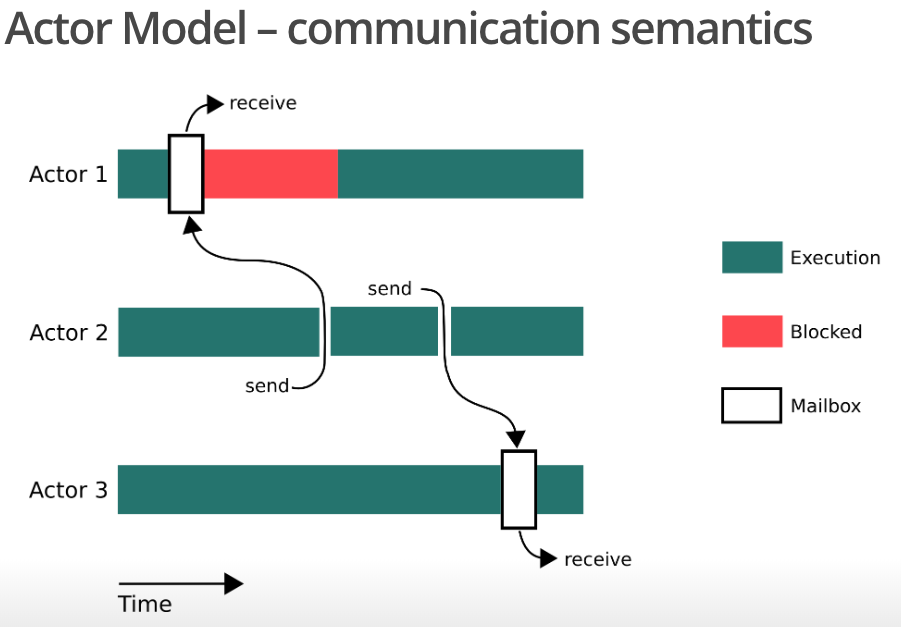

# dart特性

dart是一门务实、有亲切感的语言。务实指的是，dart很清楚语言设计出来是给人用的，语言设计以语言开发者角度出发做权衡。有亲切感指的是，dart设计中如果有打破常规的地方，会用温和的方式让开发者接受，开发者上手很快。

## 范式

在现代编程语言层出不穷的今天，越来越多的语言拥抱面向接口/协议编程，这还是归结于面向接口而不面向实现这一原则普及的不好。dart以较为温和的方式解决这个问题，不引入新的范式，直接在面向对象编程上进行拓展。

### implicit interface

dart中不区分类和接口，类就是接口，接口就是类，类就是隐式的接口，可被其他类实现，而接口就是abstract类，同样可被其他类实现。

### factory constructor

dart设计了一种特殊的工厂构造器，这种构造器可以返回缓存的对象或者符合类接口的其他类型，突破了传统面向对象编程构造器只能返回新建原类型实例的局限，将Factory设计模式融入语言中，帮助开发者更加面向接口、更少面向具体实现。

### mixin

dart加入了mixin，mixin并不是dart发明的，mixin很早就存在为了解决多继承问题，mixin可看做带实现的接口。

在dart中，mixin其实就是语法糖，dart会为mixin创建新的类，并重写使用mixin类的继承关系。重写的继承关系中，mixin优于extends，mixin内部优先级按照声明顺序，形成一个确定的继承顺序，没有模糊的行为。

## 类型编程

> The Dart language is type safe: it uses a combination of static type checking and [runtime checks](https://dart.dev/guides/language/sound-dart#runtime-checks) to ensure that a variable’s value always matches the variable’s static type. Although _types_ are mandatory, type _annotations_ are optional because of [type inference](https://dart.dev/guides/language/sound-dart#type-inference).
>
>  — The dart type system

静态类型和动态类型就像是一个从静态到动态的仪表盘，一门语言需要选择自己的方向。静态类型和动态类型的本质区别是有没有**编译期的类型检查**。静态类型倾向安全性，类型注解及编译器进行类型检查，将运行时错误提前到编译时暴露。动态类型则倾向灵活性，没有约束和限制可以写成更有趣的程序。过分强调静态类型会使得类型系统复杂且难以使用，过分强调动态类型会使得类型不明，难以维护。

**dart在仪表盘中间的位置，是种渐进类型语言，期望做到类型可插拔，将类型归为工具而不是语言的一部分。dart提供了类型注解，且类型注解可选，有类型注解可进行非严格的编译期类型检查，没有类型注解就是动态类型。**

类型注解的添加和消除，其实就是静态类型和动态类型的转换，关键的一点就是要保证这种转换不会改变运行时的行为。这会造成类型注解可选不光是编译器级别的设计，还是语言级别的设计。这就是dart语言强调的类型注解不会影响语义。

由于编译期检查是非严格，dart中对象实际存在两个类型，类型注解类型和运行时类型。为了能够type-safe，除了编译期检查由编译器做类型推断完成，还需要在运行时再度检查，运行时将运行时类型与类型注解类型匹配，如果不匹配，会直接中断报出清晰的错误，类似断言。

## 编译型与解释型

dart不光在类型编程上支持静态类型和动态类型，dart也同时支持编译型和解释型：

* 解释型：JIT模式下，dartvm的解释。
* 编译型：AOT模式下，目标机器代码编译。

解释型和编译型是两个平行的方式，没有本质区别，能够解释肯定也能够编译，反之亦然，就看语言作为工具如何被使用。除此了解释和编译之外，dart同时还具备翻译成其他语言的能力和相关的官方工具。

## 并发程序设计

dart中有两种并发程序设计方式：

* async/await：基于事件驱动，并发但不一定并行。
* isolate：基于线程，并发又并行。

在dart中，async/awai背后是future，而future的背后是timer和事件驱动\(eventloop\)，关于async/await就不用多说了，这种并发程序设计基本是GUI系统异步编程的标配了，着重来看下isolate这种方式。

### Isolate

dart为并发程序设计做了语言级别的抽象，并想彻底解决多线程资源共享问题，**isolate就是这层对并发程序设计/线程的抽象**，isolate具有物理隔离\(内存/代码隔离\)，dart认为只有内存隔离才能从根本上解决多线程的内存共享问题。

**Actor模型**

从模型上来讲，为了实现对线程抽象、内存隔离这两点，dart选择了Actor模型。Actor模型中的基本通信单位都是Actor，多个Actor通过mailbox通信，通信过程是充分隔离的投递消息：



Actor不单单是个通信模型，模型更多的是种以并发角度出发的范式，**范式世界观就是一切都是接收消息后做响应的角色，其实就是面向对象的并发版本**。

范式有几点关键设计：

* 发送者以异步消息形式等待响应。
* 角色之间通过地址通信，角色只能与拥有地址的角色通信。
* 消息不保证抵达和顺序。
* 响应者可以创建新角色去响应消息。

actor模型设计上可以使得模型本地调用和远程调用一致，这样就是天然实现了内存隔离。并且Actor模型作为个以并发角度出发的范式，给用户提供的线程面向对象抽象再合适不过了。

**线程**

从线程上来讲，dart runtime内部有两个线程类OSThread和Thread，OSThread源码：

```cpp
​
#if defined(HOST_OS_ANDROID)
#include "vm/os_thread_android.h"
#elif defined(HOST_OS_FUCHSIA)
#include "vm/os_thread_fuchsia.h"
#elif defined(HOST_OS_LINUX)
#include "vm/os_thread_linux.h"
#elif defined(HOST_OS_MACOS)
#include "vm/os_thread_macos.h"
#elif defined(HOST_OS_WINDOWS)
#include "vm/os_thread_win.h"
#else
#error Unknown target os.
#endif
​
namespace dart {
​
class BaseThread {
 public:
  bool is_os_thread() const { return is_os_thread_; }
​
 private:
  explicit BaseThread(bool is_os_thread) : is_os_thread_(is_os_thread) {}
  virtual ~BaseThread() {}
​
  bool is_os_thread_;
​
  friend class ThreadState;
  friend class OSThread;
​
  DISALLOW_IMPLICIT_CONSTRUCTORS(BaseThread);
};
​
// Low-level operations on OS platform threads.
class OSThread : public BaseThread {
 public:
  // The constructor of OSThread is never called directly, instead we call
  // this factory style method 'CreateOSThread' to create OSThread structures.
  // The method can return a NULL if the Dart VM is in shutdown mode.
  static OSThread* CreateOSThread();
  ~OSThread();
​
  friend class Isolate;  // to access set_thread(Thread*).
};
​
}
```

从宏区分include可以看出OSThread是抽象不同平台的统一线程类，真正的实现是各个平台下的ThreadInlineImpl类，源码：

```cpp
namespace dart {
​
typedef pthread_key_t ThreadLocalKey;
typedef pthread_t ThreadId;
typedef pthread_t ThreadJoinId;
​
static const ThreadLocalKey kUnsetThreadLocalKey =
    static_cast<pthread_key_t>(-1);
​
class ThreadInlineImpl {
 private:
  ThreadInlineImpl() {}
  ~ThreadInlineImpl() {}
​
  static uword GetThreadLocal(ThreadLocalKey key) {
    static ThreadLocalKey kUnsetThreadLocalKey = static_cast<pthread_key_t>(-1);
    ASSERT(key != kUnsetThreadLocalKey);
    return reinterpret_cast<uword>(pthread_getspecific(key));
  }
​
  friend class OSThread;
​
  DISALLOW_ALLOCATION();
  DISALLOW_COPY_AND_ASSIGN(ThreadInlineImpl);
};
​
}
```

Thread源码：

```cpp
namespace dart {
​
// A VM thread; may be executing Dart code or performing helper tasks like
// garbage collection or compilation. The Thread structure associated with
// a thread is allocated by EnsureInit before entering an isolate, and destroyed
// automatically when the underlying OS thread exits. NOTE: On Windows, CleanUp
// must currently be called manually (issue 23474).
class Thread : public ThreadState {
 public:
  // The kind of task this thread is performing. Sampled by the profiler.
  enum TaskKind {
    kUnknownTask = 0x0,
    kMutatorTask = 0x1,
    kCompilerTask = 0x2,
    kMarkerTask = 0x4,
    kSweeperTask = 0x8,
    kCompactorTask = 0x10,
  };
  // Converts a TaskKind to its corresponding C-String name.
  static const char* TaskKindToCString(TaskKind kind);
​
  ~Thread();
​
  // The currently executing thread, or NULL if not yet initialized.
  static Thread* Current() {
#if defined(HAS_C11_THREAD_LOCAL)
    return static_cast<Thread*>(OSThread::CurrentVMThread());
#else
    BaseThread* thread = OSThread::GetCurrentTLS();
    if (thread == NULL || thread->is_os_thread()) {
      return NULL;
    }
    return static_cast<Thread*>(thread);
#endif
  }
​
  // Makes the current thread enter 'isolate'.
  static bool EnterIsolate(Isolate* isolate) {
    const bool kIsMutatorThread = true;
    Thread* thread = isolate->ScheduleThread(kIsMutatorThread);
    if (thread != NULL) {
      ASSERT(thread->store_buffer_block_ == NULL);
      thread->task_kind_ = kMutatorTask;
      thread->StoreBufferAcquire();
      if (isolate->marking_stack() != NULL) {
        // Concurrent mark in progress. Enable barrier for this thread.
        thread->MarkingStackAcquire();
        thread->DeferredMarkingStackAcquire();
      }
      return true;
    }
    return false;
}
  
  // Makes the current thread exit its isolate.
  static void ExitIsolate() {
    Thread* thread = Thread::Current();
    ASSERT(thread != NULL && thread->IsMutatorThread());
    DEBUG_ASSERT(!thread->IsAnyReusableHandleScopeActive());
    thread->task_kind_ = kUnknownTask;
    Isolate* isolate = thread->isolate();
    ASSERT(isolate != NULL);
    ASSERT(thread->execution_state() == Thread::kThreadInVM);
    // Clear since GC will not visit the thread once it is unscheduled.
    thread->ClearReusableHandles();
    if (thread->is_marking()) {
      thread->MarkingStackRelease();
      thread->DeferredMarkingStackRelease();
    }
    thread->StoreBufferRelease();
    if (isolate->is_runnable()) {
      thread->set_vm_tag(VMTag::kIdleTagId);
    } else {
      thread->set_vm_tag(VMTag::kLoadWaitTagId);
    }
    const bool kIsMutatorThread = true;
    isolate->UnscheduleThread(thread, kIsMutatorThread);
}
​
};
​
}
```

Thread类是vm runtime中使用的线程，从TaskKind声明的枚举来看，vm中会固有几个线程做编译和GC。EnterIsolate方法是将线程和Isolate关联的地方，具体实现在Isolate源码中：

```cpp
Thread* Isolate::ScheduleThread(bool is_mutator, bool bypass_safepoint) {
  // Schedule the thread into the isolate by associating
  // a 'Thread' structure with it (this is done while we are holding
  // the thread registry lock).
  Thread* thread = nullptr;
  OSThread* os_thread = OSThread::Current();
  if (os_thread != nullptr) {
    // We are about to associate the thread with an isolate and it would
    // not be possible to correctly track no_safepoint_scope_depth for the
    // thread in the constructor/destructor of MonitorLocker,
    // so we create a MonitorLocker object which does not do any
    // no_safepoint_scope_depth increments/decrements.
    MonitorLocker ml(threads_lock(), false);
​
    // Check to make sure we don't already have a mutator thread.
    if (is_mutator && scheduled_mutator_thread_ != nullptr) {
      return nullptr;
    }
​
    // If a safepoint operation is in progress wait for it
    // to finish before scheduling this thread in.
    while (!bypass_safepoint && safepoint_handler()->SafepointInProgress()) {
      ml.Wait();
    }
​
    // Now get a free Thread structure.
    thread = thread_registry()->GetFreeThreadLocked(this, is_mutator);
    ASSERT(thread != nullptr);
​
    thread->ResetHighWatermark();
​
    // Set up other values and set the TLS value.
    thread->isolate_ = this;
    ASSERT(heap() != nullptr);
    thread->heap_ = heap();
    thread->set_os_thread(os_thread);
    ASSERT(thread->execution_state() == Thread::kThreadInNative);
    thread->set_execution_state(Thread::kThreadInVM);
    thread->set_safepoint_state(
        Thread::SetBypassSafepoints(bypass_safepoint, 0));
    thread->set_vm_tag(VMTag::kVMTagId);
    ASSERT(thread->no_safepoint_scope_depth() == 0);
    os_thread->set_thread(thread);
    if (is_mutator) {
      scheduled_mutator_thread_ = thread;
    }
    Thread::SetCurrent(thread);
    os_thread->EnableThreadInterrupts();
  }
  return thread;
}
```

浏览过源码后，isolate与线程之间的设计就比较清楚了：

* 为适配不同操作系统设计OSThread。
* 为vm设计Thread。
* 为外部和概念抽象设计isolate。

## 引用

[https://www.yuque.com/xytech/flutter/kwoww1\#d2tpbo](https://www.yuque.com/xytech/flutter/kwoww1#d2tpbo)

[http://dart.goodev.org/articles/language/optional-types](http://dart.goodev.org/articles/language/optional-types)

